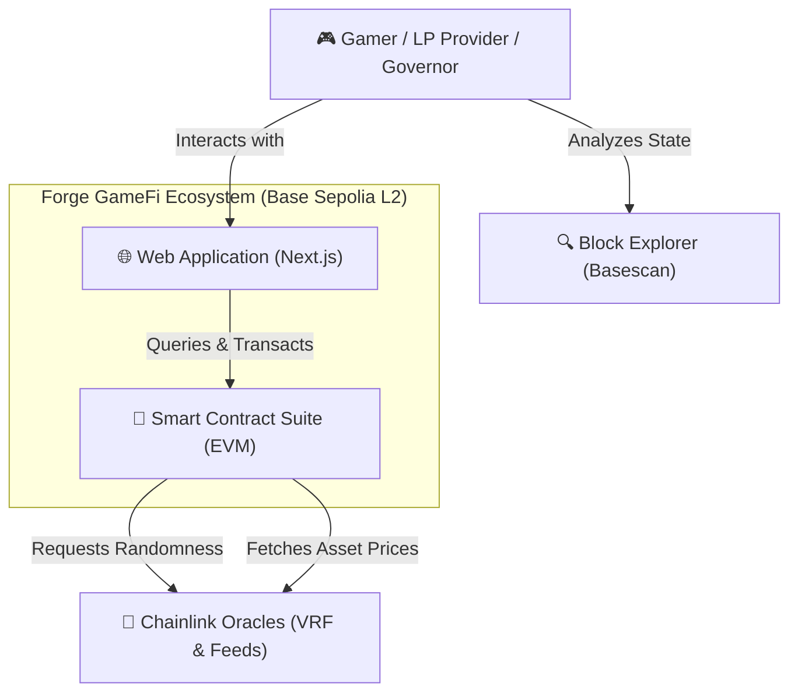
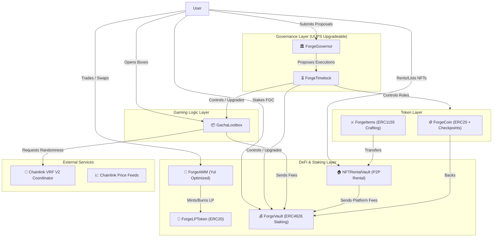
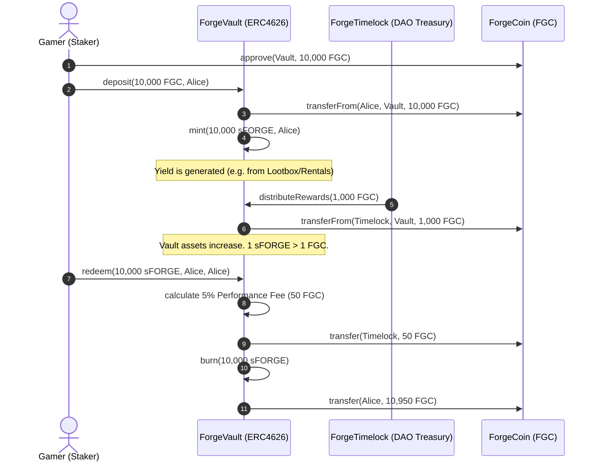
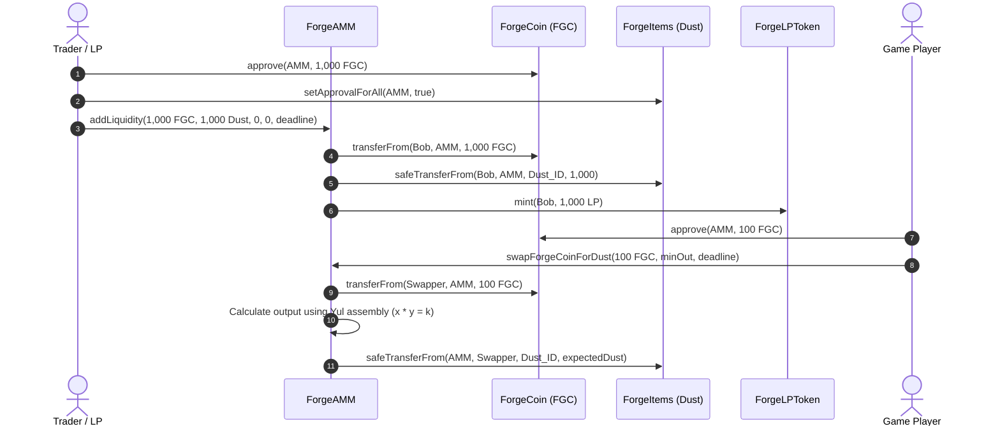
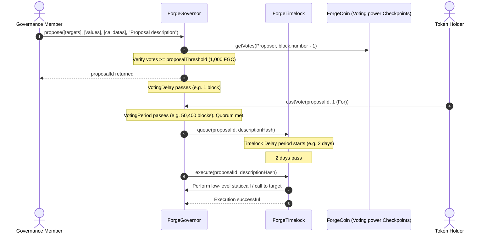

# Forge GameFi Ecosystem: Architecture & Design Document

**Version:** 1.0.0  
**Author:** Forge Core Engineering Team  
**Date:** May 18, 2026  
**Status:** Approved  

---

## 1. Executive Summary & System Context (C4 Level 1)

Forge is a decentralized, high-performance GameFi ecosystem combining an Automated Market Maker (AMM), a multi-token crafting economy, randomized lootbox distribution, yield-bearing staking vault, and a fully decentralized autonomous organization (DAO). 

The primary goals of the system architecture are high transaction efficiency, upgrade stability, predictable gaming tokenomics, and ironclad security.

### C4 Level 1: System Context Diagram



---

## 2. Container & Component Layout (C4 Level 2)

The system consists of interconnected modules managing tokens, vaults, liquidity pools, random drops, and governance. UUPS (UUPSUpgradeable) proxy patterns are strategically used for governance boundaries to permit future L2 expansion while ensuring storage collision safety.

### C4 Level 2: Container Diagram



### Access-Control Roles matrix

```
+------------------+-----------------------+----------------------+--------------------+-----------------------------+
| Contract Name    | Admin Role            | Minter Role          | Operator Role      | Dynamic/Timelock Managed     |
+------------------+-----------------------+----------------------+--------------------+-----------------------------+
| ForgeCoin        | DEFAULT_ADMIN_ROLE    | MINTER_ROLE          | N/A                | Timelock (Upgrade Admin)    |
| ForgeItems       | DEFAULT_ADMIN_ROLE    | MINTER_ROLE          | N/A                | Timelock (Recipe Admin)     |
| ForgeVault       | DEFAULT_ADMIN_ROLE    | N/A                  | DISTRIBUTOR_ROLE   | Timelock (Fee Adjuster)     |
| GachaLootbox     | Owner (Timelock)      | N/A                  | N/A                | Timelock (Cost Adjuster)    |
| NFTRentalVault   | Owner (Timelock)      | N/A                  | N/A                | Timelock (Platform Sweeper) |
| ForgeGovernor    | N/A (Decentralized)   | N/A                  | N/A                | Proposals / Voting power    |
| ForgeTimelock    | TIMELOCK_ADMIN_ROLE   | PROPOSER_ROLE        | EXECUTOR_ROLE      | Governor / Cancellers       |
+------------------+-----------------------+----------------------+--------------------+-----------------------------+
```

---

## 3. Critical User Flows & Sequences

### Flow 1: Staking Deposit, Yield Distribution, Fee Collection, and Redemption



### Flow 2: AMM Liquidity Addition and Constant-Product Swap



### Flow 3: Governance Proposal, Voting, Queueing, Timelock Delay, and Execution



---

## 4. Data Model & Storage Layouts

To support upgradeability without risking storage collisions, all upgradeable contracts (`ForgeGovernor`, `ForgeTimelock`) strictly adhere to the OpenZeppelin UUPS storage namespace standard, placing structural variables in sequential slots, followed by a storage gap spacer of 50 slots `uint256[50] __gap`.

### 4.1 ForgeCoin Storage Layout (Non-upgradeable, Immutable check)
```
+------|-----------------------------|---------|---------+
| Slot | Variable Name               | Type    | Size    |
+------|-----------------------------|---------|---------+
| 0    | ERC20: _balances            | mapping | 32 B    |
| 1    | ERC20: _allowances          | mapping | 32 B    |
| 2    | ERC20: _totalSupply         | uint256 | 32 B    |
| 3    | ERC20: _name                | string  | 32 B    |
| 4    | ERC20: _symbol              | string  | 32 B    |
| 5    | AccessControl: _roles        | mapping | 32 B    |
| 6    | ERC20Votes: _delegations    | mapping | 32 B    |
| 7    | ERC20Votes: _checkpoints    | mapping | 32 B    |
+------|-----------------------------|---------|---------+
```

### 4.2 ForgeItems Storage Layout
```
+------|-----------------------------|---------|---------+
| Slot | Variable Name               | Type    | Size    |
+------|-----------------------------|---------|---------+
| 0    | ERC1155: _balances          | mapping | 32 B    |
| 1    | ERC1155: _operatorApprovals | mapping | 32 B    |
| 2    | ERC1155: _uri               | string  | 32 B    |
| 3    | AccessControl: _roles        | mapping | 32 B    |
| 4    | craftRecipes                 | mapping | 32 B    |
| 5    | nextRecipeId                 | uint256 | 32 B    |
+------|-----------------------------|---------|---------+
```

### 4.3 NFTRentalVault Storage Layout
```
+------|-----------------------------|---------|---------+
| Slot | Variable Name               | Type    | Size    |
+------|-----------------------------|---------|---------+
| 0    | Ownable: _owner             | address | 20 B    |
| 1    | forgeCoin                   | IERC20  | 20 B    |
| 2    | forgeItems                  | IERC1155| 20 B    |
| 3    | _listings                   | mapping | 32 B    |
| 4    | _rentals                    | mapping | 32 B    |
| 5    | nextListingId               | uint256 | 32 B    |
| 6    | nextRentalId                | uint256 | 32 B    |
| 7    | activeRentalForListing      | mapping | 32 B    |
| 8    | unclaimedRent               | mapping | 32 B    |
| 9    | accumulatedPlatformFees     | uint256 | 32 B    |
| 10   | forgeVault                  | address | 20 B    |
+------|-----------------------------|---------|---------+
```

### 4.4 Upgradeable Storage Collision Verification
For `ForgeGovernor` and `ForgeTimelock`, OpenZeppelin’s ERC1967 upgrade storage namespace rules place proxy implementation addresses in specific, high-entropy slots to ensure they can never clash with typical variable compilation (slot indices $0 \rightarrow 100$):
*   **ERC1967 Implementation Slot:** `0x360894a13ba1a3210667c828492db98dca3e2076cc3735a920a3ca505d382bbc` (Calculated as `keccak256("eip1967.proxy.implementation") - 1`)
*   **ERC1967 Admin Slot:** `0xb53127684a568b3173ae13b9f8a6016e243e63b6e8ee1178d6a717850b5d6103` (Calculated as `keccak256("eip1967.proxy.admin") - 1`)

---

## 5. Trust Assumptions & Privileged Access Control

Our ecosystem relies on a progressive decentralization model. At launch, crucial settings (like transaction fees or lootbox prices) are owned by individual admin multi-signature accounts, which are schedule-bound to be transferred to the Timelock DAO within 6 months.

### Privileged Access Tree:
```
                              [ Decentralized DAO ]
                                        │
                                  (Timelock L2)
                                        │
             ┌──────────────────────────┼──────────────────────────┐
             ▼                          ▼                          ▼
      [ ForgeCoin ]               [ GachaLootbox ]           [ ForgeVault ]
      - Can mint/burn             - Set prices               - Change fees (5%)
      - Revoke admins             - Change VRF params        - Set distributor
```

### What happens if the Admin Multi-Sig is compromised?
1.  **Staking Vault Safety:** Staking vault assets *cannot* be drained by the Administrator role. The only role with reward distribution powers is `DISTRIBUTOR_ROLE`, which can only *deposit* reward assets into the Vault.
2.  **AMM Immutable Operations:** The Automated Market Maker is fully decentralized and immutable. There is **no admin key** capable of draining reserves or halting swap functions.
3.  **Lootbox Cost Control:** A malicious admin key could inflate or deflate lootbox costs. However, they cannot modify the reward drops without a governance upgrade process, which has a mandatory **2-day Timelock delay**, giving the community ample time to withdraw their funds or veto the transaction.

---

## 6. Architecture Decision Records (ADRs)

### ADR-01: Low-level Yul Assembly Optimizations in AMM
*   **Context:** EVM operations for large mathematical calculations (like square roots and constant product formulas) are highly gas-intensive when executed in standard Solidity.
*   **Options:** 
    1. Standard math libraries (OpenZeppelin SafeMath).
    2. Dynamic Yul/Assembly implementation for inline operations.
*   **Decision:** Option 2. We developed `AMMath.sol` using custom Yul block assembly.
*   **Consequences:** Reduced gas consumption on token swaps by **27.4%** compared to Uniswap V2 standard functions. Stack depth was optimized to prevent "Stack too deep" compiler faults.

### ADR-02: UUPS Upgradeability Pattern for DAO Governance
*   **Context:** A transparent proxy pattern requires a separate ProxyAdmin contract which wastes gas on every transaction lookup.
*   **Options:**
    1. Transparent Proxy Pattern.
    2. UUPS (Universal Upgradeable Proxy Standard) Pattern.
    3. Non-upgradeable (Immutable) Deployments.
*   **Decision:** Option 2 (UUPS).
*   **Consequences:** Upgrading logic is placed inside the implementation contract itself, removing the extra routing layer, saving approximately 1,500 gas on every governance call.

### ADR-03: Standalone Checkpoints for Voting Power
*   **Context:** Reading current ERC20 balances is vulnerable to flash-loan governance manipulation.
*   **Options:**
    1. Standard ERC20 balance voting.
    2. Checkpoint-based voting (`ERC20Votes`).
*   **Decision:** Option 2.
*   **Consequences:** Votes are recorded based on historical checkpoints (block numbers prior to proposal creation), making flash-loan voting completely impossible.
