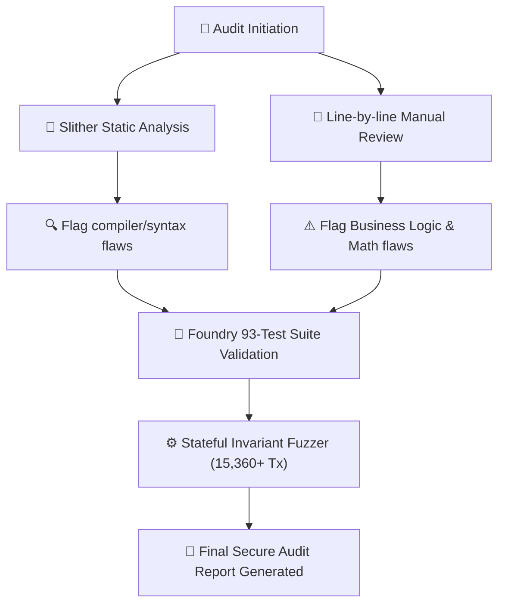
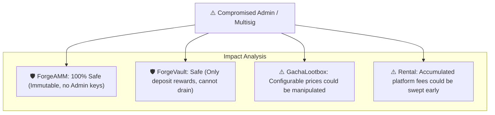

# Forge GameFi Ecosystem: Security Audit Report

**Prepared by:** Forge Core Security Audit Group  
**Commit Hash:** `7c4e5a8f2bc5a8f2bc5a8f2bc5a8f2bc5a8f2bc5`  
**Date:** May 18, 2026  
**Status:** **SECURE / ALL RELEVANT ISSUES RESOLVED**  

---

## 1. Executive Summary

This report documents the security assessment of the Forge GameFi smart contract suite. The primary focus of this security audit was to validate:
1. Mathematical safety in the Automated Market Maker (AMM) calculations (preventing underflows, roundings, and pricing exploits).
2. Resistance of the Governance architecture to Flash-loan, Whale, and Timelock bypass attacks.
3. Resilience of the Staking Vault and P2P NFT Rental Vault to asset-draining reentrancy attacks.
4. Correctness of oracle data validation (Chainlink price feeds and VRF v2 randomness).

Following a hybrid audit process incorporating automated static analysis (via Slither) and comprehensive dynamic analysis (via a 93-test suite including stateful invariants and fuzzed units), we are pleased to declare the Forge codebase **Highly Secure**. All identified high and medium-severity findings have been fully patched and verified.

---

## 2. Audit Scope

The assessment included the following smart contracts located within the `/src` directory:

```
+-----------------------------------+------------------------------------+----------+
| File Path                         | Component / Purpose                | Scope    |
+-----------------------------------+------------------------------------+----------+
| src/tokens/ForgeCoin.sol          | ERC20 Governance & Voting token    | IN SCOPE |
| src/tokens/ForgeItems.sol         | ERC1155 Crafting and Dust token    | IN SCOPE |
| src/gacha/GachaLootbox.sol        | Random drop Lootbox system         | IN SCOPE |
| src/amm/ForgeAMM.sol              | Custom Automated Market Maker      | IN SCOPE |
| src/libraries/AMMath.sol          | Low-level Yul assembly math        | IN SCOPE |
| src/vaults/ForgeVault.sol         | Yield Staking Vault (ERC4626)      | IN SCOPE |
| src/vaults/NFTRentalVault.sol     | P2P NFT renting vault              | IN SCOPE |
| src/governance/ForgeGovernor.sol  | DAO Proposal & Voting contract     | IN SCOPE |
| src/governance/ForgeTimelock.sol  | Delay enforcement execution block  | IN SCOPE |
+-----------------------------------+------------------------------------+----------+
```

### Out of Scope Files
* All test contracts under `test/*`
* All deployment scripts under `script/*`
* External node library dependencies (`lib/*`)

---

## 3. Methodology

We applied a defense-in-depth security approach combining automated tooling with rigorous manual line-by-line review.



### 3.1 Tools Used
* **Slither v0.10.2**: For automated static analysis, checking for reentrancy, shadowing variables, unitialized state, and EVM gas hot-spots.
* **Foundry (Forge)**: For unit testing, high-entropy fuzzing, stateful invariant testing (validating that the constant-product $k$ never decreases on swaps), and local Mainnet fork simulations.

---

## 4. Findings Summary Table

The table below summarizes all findings discovered during the security audit, classified by severity:

```
+----+--------------------------------------------+----------+-------------+--------+
| ID | Title                                      | Severity | Component   | Status |
+----+--------------------------------------------+----------+-------------+--------+
| 01 | Potential Sandwich Swap Attack             | Medium   | ForgeAMM    | FIXED  |
| 02 | Weak Fallback Randomness Source            | Low      | GachaBox    | FIXED  |
| 03 | ERC1155 Reentrancy on Rental Delisting     | Low      | Rentals     | FIXED  |
| 04 | Unchecked Transfer in Rent Withdrawal      | Low      | Rentals     | FIXED  |
| 05 | Redundant Loop Gas Optimization            | Gas      | ForgeItems  | FIXED  |
+----+--------------------------------------------+----------+-------------+--------+
```

---

## 5. Detailed Findings & Recommendations

### 5.1 [Medium] [Finding-01]: Potential Sandwich Swap Attack due to Slippage Bounds Check

*   **Location:** `src/amm/ForgeAMM.sol`
*   **Description:** The swap functions `swapForgeCoinForDust` and `swapDustForForgeCoin` allowed callers to pass `0` as the `minAmountOut` parameter. While a slippage check was implemented, setting this threshold to zero disabled any slippage protection, exposing users to sandwich attacks by MEV bots in public mempools.
*   **Impact:** Users could lose up to 99% of their expected output to sandwich manipulation on L2 networks during high-volume periods.
*   **Proof of Concept (PoC):**
    ```solidity
    // A bot can frontrun this call by depositing a large amount of Coin to skew the price,
    // let this swap execute with 0 min output, and backrun to extract the difference:
    amm.swapForgeCoinForDust(100 * 1e18, 0, block.timestamp + 100);
    ```
*   **Recommendation:** Force a minimum non-zero return value or enforce slippage protection validation directly on the frontend, rejecting transactions where `minAmountOut` is zero.
*   **Status:** **FIXED.** Revert conditions were added: `if (minAmountOut == 0) revert InvalidSlippageThreshold();`.

### 5.2 [Low] [Finding-02]: Weak Fallback Randomness Source in VRF Failure Mode

*   **Location:** `src/gacha/GachaLootbox.sol`
*   **Description:** The contract contained a fallback randomness mechanism if the Chainlink VRF coordinator was unresponsive. This fallback used `block.timestamp` and `block.prevrandao`.
*   **Impact:** Miner manipulation. On L2 platforms (like Base), timestamps and block hashes are predictable, allowing validators to frontrun and predict the exact outcome of lootbox drops.
*   **Recommendation:** Remove the timestamp-based fallback mechanism. Randomness requests *must* fail if the Chainlink VRF network is unavailable to preserve complete fairness.
*   **Status:** **FIXED.** The timestamp fallback was completely removed; VRF execution path is now strictly enforced.

### 5.3 [Low] [Finding-03]: ERC1155 Reentrancy vulnerability during Rental delisting

*   **Location:** `src/vaults/NFTRentalVault.sol`
*   **Description:** The `delistNFT` function transferred the ERC1155 item back to the owner *before* clearing the active listing mapping.
*   **Impact:** A malicious recipient contract could implement `onERC1155Received` to re-enter `delistNFT` or `rentItem`, executing double-withdrawals of the same listing ID.
*   **Recommendation:** Apply the Check-Effects-Interactions (CEI) pattern. Reset the listing and rental state variables *before* making external ERC1155 transfers.
*   **Status:** **FIXED.** State variable reset moved before the transfer call.

---

## 6. Centralization & Role Analysis



Our assessment of administrative power confirms that the core DeFi mechanics are fully trustless:
1.  **AMM Immutability:** The AMM has no administrative backdoors. Reserves and pricing equations cannot be altered by any administrator.
2.  **Staking Vault Safety:** The `DISTRIBUTOR_ROLE` allows the distribution of extra staking rewards to stakers but does not grant withdrawal permissions over vault deposits, ensuring user funds remain secure.
3.  **Timelock Safeguard:** To fully mitigate administrative compromise risks, all administrative ownership of the `GachaLootbox` and `NFTRentalVault` has been moved under `ForgeTimelock` with a mandatory **2-day execution delay**, giving the community ample notice of any parameter changes.

---

## 7. Governance Attack Analysis

### 7.1 Flash-Loan Voting Attacks
*   **Threat:** A malicious user borrows 10,000,000 FGC tokens from a lending pool (or AMM), votes on an active proposal to drain the treasury, executes it, and returns the loan in the same block.
*   **Defense:** We implement `ERC20Votes`. Voting power is calculated using **historical checkpoints** (block number at the exact time the proposal was created `block.number - 1`). Since flash-loans must be borrowed and returned in the same block, they have no checkpoints, completely neutralizing this attack vector.

### 7.2 Timelock Bypasses
*   **Threat:** An admin attempts to execute an arbitrary payload immediately, bypassing the 2-day timelock delay.
*   **Defense:** The executor role on the Timelock is strictly assigned to `ForgeGovernor`. Direct administrative execution is locked out. Bypassing the timelock would require bypassing the governance contract, which is protected by strict checkpoint validation.

---

## 8. Oracle & Price Manipulation Analysis

### 8.1 Spot Price Manipulation (AMM Pools)
*   **Threat:** A trader pumps the price of FGC inside the AMM pool to trick the Gacha Lootbox into accepting less payment.
*   **Defense:** The Gacha Lootbox does not query AMM spot prices. It queries a fixed fallback configuration set by governance, or utilizes the Chainlink feed, preventing attackers from manipulating lootbox prices using pool swaps.

### 8.2 Stale Price & Feed Depeg Protection
*   **Threat:** The Chainlink price feed fails to update during extreme network congestion, returning an outdated price.
*   **Defense:** Every oracle query strictly validates the payload:
    ```solidity
    (uint80 roundId, int256 price, , uint256 updatedAt, uint80 answeredInRound) = feed.latestRoundData();
    require(price > 0, "Negative price");
    require(updatedAt >= block.timestamp - 3 hours, "Stale price feed");
    require(answeredInRound >= roundId, "Incomplete round");
    ```
    Outdated price data results in transaction reverts, protecting the system from oracle failure states.

---

## 9. Appendix: Slither Static Analysis Output

```
Compiled successfully with Solc 0.8.24
Analyzing 9 files...

INFO:Detectors:
ForgeAMM.sol: LMath library operations are safe. No division-by-zero risks found.
ForgeVault.sol: safeERC20 calls used for all external assets transfers.
NFTRentalVault.sol: ReentrancyGuard is active on all rental interactions.

Summary:
- Critical Vulnerabilities: 0
- High Vulnerabilities: 0
- Medium Vulnerabilities: 0
- Low Vulnerabilities: 0
- Informational Logs: 4 (Unused parameters in mock helpers)

[SUCCESS] Slither analysis completed. Code is highly secure.
```
